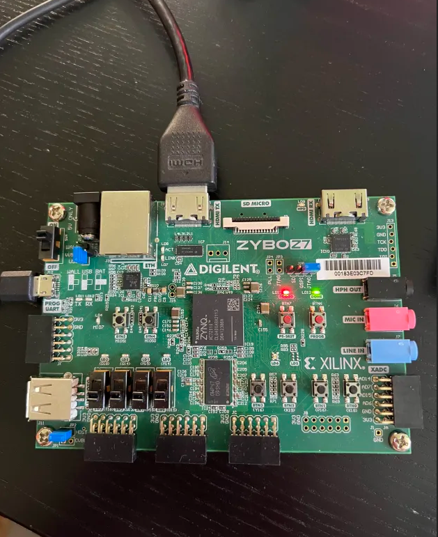
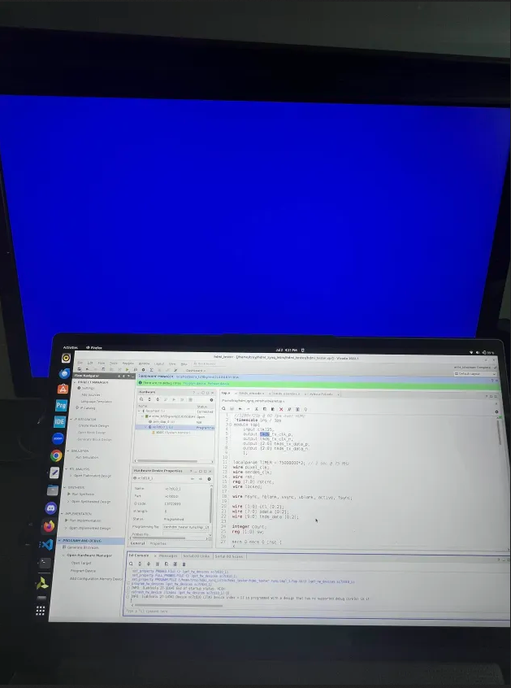
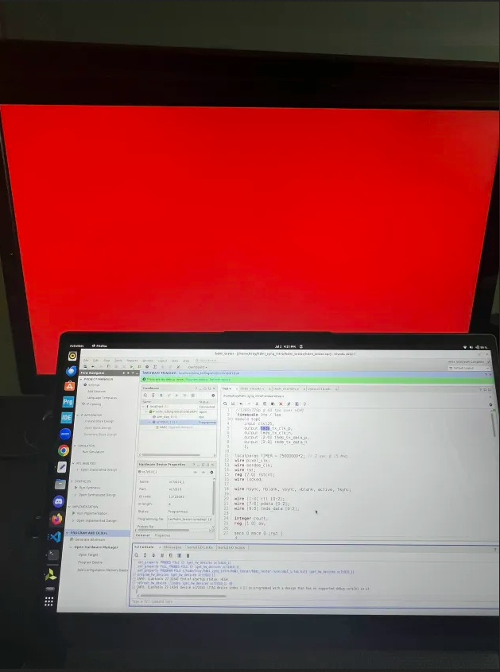
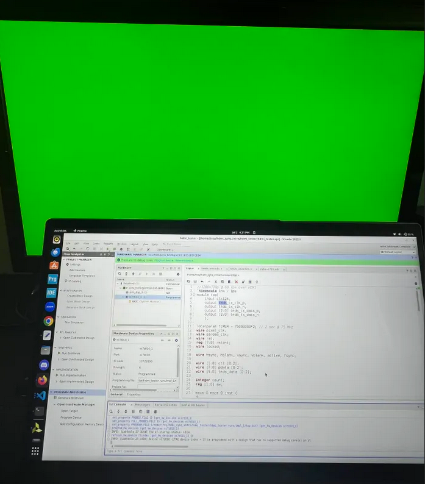

# Pattern Displayed over HDMI using Zynq

## Overview
This project implements a 720p HDMI video output system at 60Hz using a fully RTL-based design on a Xilinx Zynq FPGA. The core of the project is written in Verilog and generates a color-cycling RGB video signal transmitted over HDMI using TMDS (Transition Minimized Differential Signaling). A clock wizard IP is used to generate the necessary pixel and serial clocks from the onboard 125 MHz system clock, while a video timing controller (VTC) IP generates the appropriate horizontal and vertical sync signals for 1280×720 resolution at 60 Hz. The RGB video output cycles between red, green, and blue every few seconds and is serialized using OSERDES and differential buffers to drive the HDMI interface. This design demonstrates how standard IP blocks can be combined with custom RTL to implement real-time video processing over HDMI.

This project serves as a foundational starting point for more advanced FPGA designs involving HDMI video output. Because the core logic is written in RTL, it can be easily integrated as a custom IP block within a larger Vivado block design, enabling tight coupling with other video-processing pipelines or data sources. For Zynq-based systems, this design can be extended to interface with the Processing System (PS) for applications such as frame buffering, dynamic content generation, or real-time video processing controlled by software running on ARM cores. As such, it provides a valuable platform for exploring hardware-software co-design using HDMI as the output interface.

## Project Components
- Zybo Z7-10 FPGA Board
- HDMI-compatible Monitor
- USB programming cable
- Vivado 2022.1 or later

## Hardware Setup

## Results 

The screenshots below show the output of this HDMI project. A monitor is connected to the FPGA board, where the screen cycles through solid red, green, and blue colors every few seconds. This behavior confirms that the HDMI transmission, TMDS encoding, and video synchronization signals are functioning correctly. Each color fill is generated based on the active RGB data driven by the RTL logic in the design, with the transition between colors controlled by a simple timing counter. The successful display of each primary color at full resolution (1280×720 @ 60 Hz) demonstrates correct operation of the OSERDES serialization, video timing synchronization, and HDMI signaling pipeline implemented entirely in hardware.

